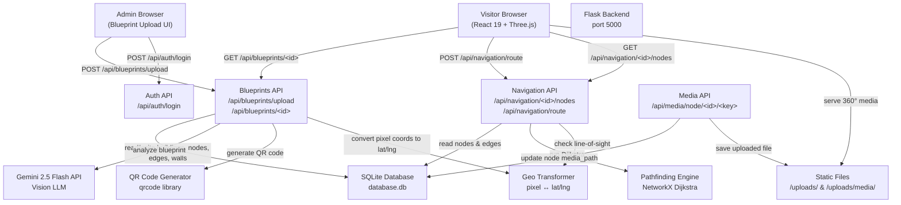

<!-- generated-by: gsd-doc-writer -->
# Architecture — AI Based Navigation System

## System overview

The AI Based Navigation System is a full-stack indoor navigation application that converts uploaded building floorplan images (blueprints) into interactive 3D navigation maps. It uses Google Gemini 2.5 Flash vision AI to extract spatial topology — nodes, walkable edges, and wall boundaries — from a blueprint image, persists the data to SQLite, and serves an interactive 3D indoor navigation experience via a Three.js/React frontend. Visitors can scan a QR code to open the navigation interface, select a destination, and receive a Dijkstra-computed shortest path rendered as a 3D route overlay on the virtual floor plan. The system follows a **layered client-server architecture** with a Flask REST API backend and a React SPA frontend communicating over HTTP JSON.

## Component diagram



**Component relationships:**
- **Admin Browser** sends blueprints to the Blueprints API, which orchestrates AI analysis, database persistence, and QR code generation.
- **Visitor Browser** fetches building data and nodes from the Blueprints and Navigation APIs, then renders the indoor map using Three.js (via `@react-three/fiber`).
- **Navigation API** uses the Pathfinding Engine (NetworkX) with optional line-of-sight wall intersection checks for custom start/end coordinates.
- **Static Files** module serves uploaded blueprint images and 360° media assets via Flask's static file routing.

## Data flow

### Blueprint upload flow (admin)

1. **Admin** uploads a PNG/JPEG blueprint image via `POST /api/blueprints/upload` with a building name and optional Google Maps link.
2. **Flask** validates the file type and extracts latitude/longitude coordinates from the Maps link (resolves `goo.gl` short links).
3. **Validation** — `validate_blueprint()` sends the image to Gemini 2.5 Flash with the extracted GPS coordinates to verify it is a valid floorplan.
4. **AI Analysis** — `process_blueprint()` sends the image to Gemini with a structured prompt requesting JSON output containing `nodes` (rooms, hallways, entrances), `edges` (walkable connections), and `walls` (physical boundaries). Coordinates are returned as 0–100 percentages, then scaled to 0–1000 integers.
5. **Persistence** — The building record, nodes (with pixel-to-lat/lng conversion via `geo_transform.py`), edges, and walls are written to SQLite tables.
6. **QR Generation** — A QR code is generated pointing to `http://localhost:5173/visitor/navigate/{buildingId}?startNode=entrance`.
7. **Response** — Returns building ID, detected node/edge/wall counts, and URLs for the uploaded blueprint and QR code image.

### Navigation flow (visitor)

1. **Visitor** scans the QR code (or navigates directly) to reach `/visitor/navigate/{buildingId}`.
2. **Frontend** fetches building data (nodes, walls, metadata) via `GET /api/blueprints/{id}`.
3. **Geo-fence check** — If the building has lat/lng coordinates, the browser requests the user's geolocation. A Haversine calculation verifies the visitor is within 2000 metres of the building.
4. **User** selects a destination node from a dropdown (start location may be pre-filled from the `?startNode=` query parameter).
5. **Route request** — Frontend sends `POST /api/navigation/route` with `building_id`, `start`, and `end` node identifiers.
6. **Backend** loads all nodes, edges, and walls for the building from SQLite, builds a NetworkX graph, runs Dijkstra's algorithm, and returns an ordered list of path coordinates.
7. **3D rendering** — The frontend renders the floor plane, walls as 3D boxes, nodes as interactive spheres, and the computed path as a polyline overlay using Three.js via `Map3D.jsx`.

### 360° media upload flow

1. Admin (or visitor with permissions) uploads a photo or video to `POST /api/media/node/{buildingId}/{nodeKey}`.
2. **Flask** saves the file to `uploads/media/` with a naming convention of `building_{id}_node_{key}.{ext}`.
3. The `media_path` and `media_type` columns on the corresponding node row are updated in SQLite.
4. **Frontend** detects nodes with `media_path` set and renders them with a purple colour. Clicking such a node switches the view to a 360° panorama (using `PanoramaViewer.jsx` with an equirectangular sphere or video texture).

## Key abstractions

| Abstraction | Description | File |
|---|---|---|
| `Flask Blueprint` | Modular route registration — each API domain (auth, blueprints, navigation, media) registers as its own blueprint | `backend/app/api/*.py` |
| `create_app()` | Application factory that initializes CORS, SQLite, upload folder, and registers all blueprints | `backend/app.py` |
| `process_blueprint()` | Sends blueprint image to Gemini 2.5 Flash, parses JSON response, and scales coordinates from 0-100 to 0-1000 | `backend/app/services/image_processor.py` |
| `get_mock_data()` | Fallback mock data (13 nodes, 14 edges) returned when no Gemini API key is configured | `backend/app/services/image_processor.py` |
| `calculate_shortest_path()` | Builds a NetworkX graph from nodes/edges and runs Dijkstra's algorithm | `backend/app/services/pathfinding.py` |
| `pixel_to_latlong()` | Converts 0-1000 pixel coordinates to real-world latitude/longitude using Haversine-based metre-to-degree conversion | `backend/app/services/geo_transform.py` |
| `latlong_to_pixel()` | Inverse conversion from GPS coordinates back to pixel coordinates (0-1000 range) | `backend/app/services/geo_transform.py` |
| `generate_qr()` | Creates a QR code image pointing to the visitor navigation URL with a `?startNode=` parameter | `backend/app/services/qr_generator.py` |
| `Map3D` | React Three Fiber component that renders the floor plane, walls as 3D boxes, nodes as interactive spheres, and route path as a polyline | `frontend/src/components/ui/Map3D.jsx` |
| `PanoramaViewer` | Renders 360° equirectangular photo or video spheres using Three.js textures | `frontend/src/components/ui/PanoramaViewer.jsx` |
| `IndoorNavigation` | Main page component orchestrating geo-fence checks, route fetching, and toggling between 3D map and panorama modes | `frontend/src/pages/IndoorNavigation.jsx` |
| `React Router` | Client-side routing for 7 pages across admin and visitor domains | `frontend/src/App.jsx` |

## Directory structure rationale

```
backend/                         # Python Flask REST API
├── app.py                       # Application factory — entrypoint, CORS, blueprint registration
├── app/
│   ├── database.py              # SQLite schema (buildings, nodes, edges, walls tables)
│   ├── api/
│   │   ├── auth.py              # Mock authentication endpoint
│   │   ├── blueprints.py        # Blueprint upload, AI analysis, and building data retrieval
│   │   ├── navigation.py        # Node listing, route computation with line-of-sight
│   │   └── media.py             # 360° photo/video upload per node
│   └── services/
│       ├── image_processor.py   # Gemini Vision AI integration for blueprint analysis
│       ├── pathfinding.py       # NetworkX Dijkstra shortest-path calculation
│       ├── geo_transform.py     # Pixel ↔ geographic coordinate conversion
│       └── qr_generator.py      # QR code image generation
├── uploads/                     # Uploaded blueprint images and media assets
├── requirements.txt             # Python dependencies (Flask, networkx, google-genai, etc.)
└── .env                         # GEMINI_API_KEY configuration

frontend/                        # React 19 SPA with Vite + Tailwind 4 + Three.js
├── src/
│   ├── main.jsx                 # React DOM entry point
│   ├── App.jsx                  # BrowserRouter with 7 routes (admin + visitor)
│   ├── pages/                   # Route-level page components
│   │   ├── LandingPage.jsx      # Public landing page (/)
│   │   ├── AdminLogin.jsx       # Admin authentication (/admin/login)
│   │   ├── AdminDashboard.jsx   # Admin overview (/admin/dashboard)
│   │   ├── BlueprintUpload.jsx  # Blueprint upload form with Gemini integration (/admin/blueprint)
│   │   ├── QrCodeGeneration.jsx # QR code display per building (/admin/qr)
│   │   ├── VisitorSelection.jsx # Building selector for visitors (/visitor/scan)
│   │   ├── IndoorNavigation.jsx # 3D navigation interface (/visitor/navigate/:buildingId)
│   │   └── ErrorPage.jsx        # 404 catch-all
│   ├── components/
│   │   ├── ui/
│   │   │   ├── Map3D.jsx        # Three.js 3D floor plan with walls, nodes, and route
│   │   │   └── PanoramaViewer.jsx  # 360° equirectangular viewer (photo/video)
│   │   └── layout/
│   │       ├── Sidebar.jsx      # Admin sidebar navigation
│   │       └── Topbar.jsx       # Top navigation bar
│   ├── context/                 # (reserved for future React context providers)
│   └── index.css                # Tailwind v4 import with custom theme variables
├── package.json                 # Dependencies (react, three, axios, tailwindcss, etc.)
├── vite.config.js               # Vite config with React + Tailwind v4 plugins
└── eslint.config.js             # ESLint flat config
```

The **backend** is organized by API domain (blueprints, navigation, media, auth) with a separate `services/` layer for external integrations (Gemini AI, geospatial math, pathfinding, QR generation). This separation keeps route handlers thin — each API blueprint is responsible for HTTP concerns while services encapsulate domain logic.

The **frontend** follows a standard React SPA layout with `pages/` for route-level components and `components/ui/` for reusable Three.js elements. The `IndoorNavigation` page is the most complex component, managing geo-fence verification, route state, and view mode toggling (3D map vs. 360° panorama).

The **SQLite database** uses four tables (`buildings`, `nodes`, `edges`, `walls`) with foreign key relationships scoped to each building. The schema supports safe migrations via `ALTER TABLE ... ADD COLUMN` with try/except guards.

### Coordinate system

The system uses a unified 0–1000 pixel coordinate space throughout:
- **Gemini AI** returns coordinates as 0–100 percentages, scaled to 0–1000 integers in `image_processor.py`
- **SVG overlay** uses `viewBox="0 0 1000 1000"` matching this coordinate space
- **Map3D** converts to Three.js world coordinates via `(coord - 500) / 10` giving a -50 to +50 range
- **Geo transform** treats the building's lat/lng as the top-left anchor and converts pixel offsets to geographic degrees using Haversine-based math
